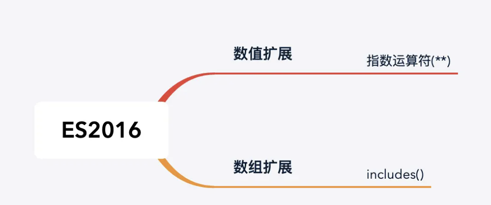

## ES 2016



### 数值扩展

#### 指数运算符：**

```
在ES2016之前，进行幂次方运算一般使用内置对象Math的pow方法，在增加**运算符之后，可以使用**代替，更为简洁

Math.pow(2,3)

可以写为：2**3

```

### 数组扩展

#### Array.prototype.includes()

```
用于判断数组是否包含指定的值，返回值为boolean

```

