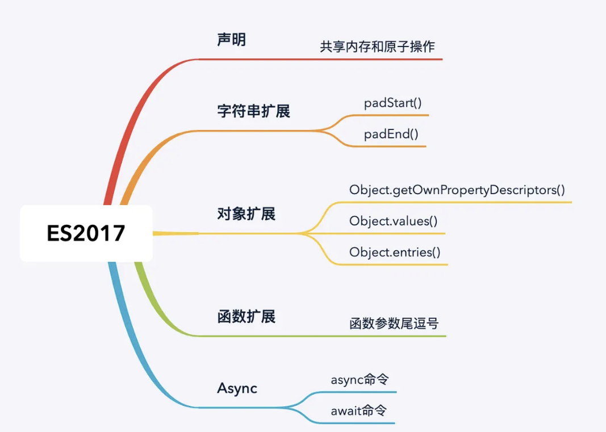

## es 2017



### 声明

#### 共享内存和原子操作：由全局对象SharedArrayBuffer和Atomics实现，将数据存储在一块共享内存中，这些数据可以在js主线程和web-worker之间共享

### 字符串扩展

#### padStart:将指定字符串填充到字符串的头部直至满足指定的长度，返回新的字符串

```
let str = 'test'

str.padStart(10,'h')  // 'hhhhhhtest'

str.padStart(10, 'anqi')  // 'anqiantest'
```

#### padEnd:将指定字符串填充到字符串的尾部，返回新的字符串

```
let str = 'test'

str.padEnd(10,'h')  // 'testhhhhhh'

str.padEnd(10, 'anqi') // 'testanqian'
```

### 对象扩展

#### Object.getOwnPropertyDescriptors()：返回对象所有的自身属性

#### Object.values()：返回value组成的数组

#### Object.entries()：返回以key:value组成的数组

#### 说明：Object.keys()是ES2015中引入，请注意区分

### 函数扩展

#### 函数参数尾逗号：允许函数最后一个参数有尾逗号

```
// 在es2017之前，函数的参数列表中是不支持尾逗号的

function f1(a, b,) {
}

/*
* 支持尾逗号的优点：
* 如果函数的参数是按照行来写的，以后在给函数新增参数的时候，不用给上一行的尾部添加逗号，这样就能避免在版本控制系统中多产生一行diff
* */

function f2(
    a,
    b,
) {
}
```

### async/await

#### async/await实际上就是generator函数的语法糖

```
声明方式：

具名函数：async function f1 () {}

函数表达式：const f2 = async function () {}

箭头函数：const f3 = async () => {}

作为对象的方法： const obj = { async f4 () {} }

作为class的方法：class C1 { async f5 () {} }
```
