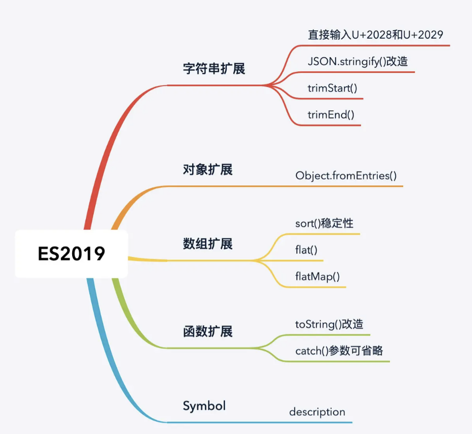

## ES 2019



### 字符串扩展

#### 字符串可以直接输入U+2028和U+2029，字符串可以直接输入行分隔符和段分隔符

#### JSON.stringify()增强：可以返回不符合UTF-8标准的字符串

```
根据标准，json数据必须是utf-8编码，但是现在JSON.stringify()方法有可能会返回不符合utf-8标准的字符串

具体来说，UTF-8 标准规定，0xD800到0xDFFF之间的码点，不能单独使用，必须配对使用。

比如，\uD834\uDF06是两个码点，但是必须放在一起配对使用，代表字符𝌆。

这是为了表示码点大于0xFFFF的字符的一种变通方法。单独使用\uD834和\uDFO6这两个码点是不合法的，

或者颠倒顺序也不行，因为\uDF06\uD834并没有对应的字符。

JSON.stringify()的问题在于，它可能返回0xD800到0xDFFF之间的单个码点。

JSON.stringify('\u{D834}') // "\u{D834}"

为了确保返回的是合法的 UTF-8 字符，ES2019 改变了JSON.stringify()的行为。

如果遇到0xD800到0xDFFF之间的单个码点，或者不存在的配对形式，它会返回转义字符串，留给应用自己决定下一步的处理。

JSON.stringify('\u{D834}') // ""\\uD834""

JSON.stringify('\uDF06\uD834') // ""\\udf06\\ud834""
```

#### trimStart()：消除字符串头部空格，返回新的字符串

#### trimEnd()：消除字符串尾部空格，返回新的字符串

```
let str = '   test    '

str.trimStart() // 'test    '

str.trimEnd() // '   test'
```

### 对象扩展

#### sort()确保排序稳定性：早期ECMA标准中，sort()方法的排序行为是否稳定，留给各家浏览器自行决定，而从es2019开始，要求该排序必须稳定

#### flat()：数组扁平化，返回新数组

```
let arr = [1,[2,[3]]]

arr.flat() // [1,2,[3]]

如果不传参数，默认扁平深度为1，上述操作等价于arr.flat(1)

如果想将数组的所有层级都扁平化，可以直接传入Infinity

arr.flat(Infinity) // [1,2,3]
```

#### flatMap(): 映射且扁平化数组，返回新数组，但是只能展开一层数组

```
有时候我们可能会有以下操作

const duplicate = (x) => [x,x] 

const mapArr = [1,2,3].map(duplicate) // [[1,1],[2,2],[3,3]]

mapArr.flat() // [1,1,2,2,3,3]

上述过程可以简化为

[1,2,3].flatMap(duplicate)
```

### 函数扩展

#### toString()

```
es2019之前，函数的toString()方法会剥离注释和其他字符（例如空格）

function /* 这是一个函数 */ f1 (){}

f1.toString() // 'function f1 (){}'

es2019中，会避免上述行为，从而准确地代表所定义的函数

f1.toString() // 'function /* 这是一个函数 */ f1 (){}'

```

#### catch()参数可以省略：JavaScript 语言的try...catch结构，以前明确要求catch命令后面必须跟参数，接受try代码块抛出的错误对象。

```
try {
  // ...
} catch (err) {
  // 处理错误
}

上面代码中，catch命令后面带有参数err。

很多时候，catch代码块可能用不到这个参数。但是，为了保证语法正确，还是必须写。ES2019 做出了改变，允许catch语句省略参数。

try {
  // ...
} catch {
  // ...
}
```

### Symbol

#### description: 返回symbol值的描述

```
创建 Symbol 的时候，可以添加一个描述。

const sym = Symbol('foo');

上面代码中，sym的描述就是字符串foo。

但是，读取这个描述需要将 Symbol 显式转为字符串，即下面的写法。

const sym = Symbol('foo');

String(sym) // "Symbol(foo)"

sym.toString() // "Symbol(foo)"

上面的用法不是很方便。ES2019 提供了一个实例属性description，直接返回 Symbol 的描述。

const sym = Symbol('foo');

sym.description // "foo"
```